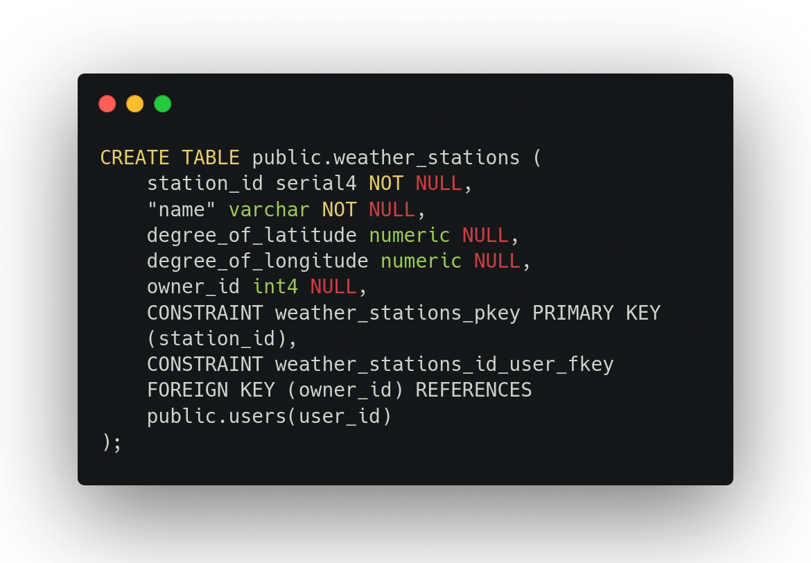
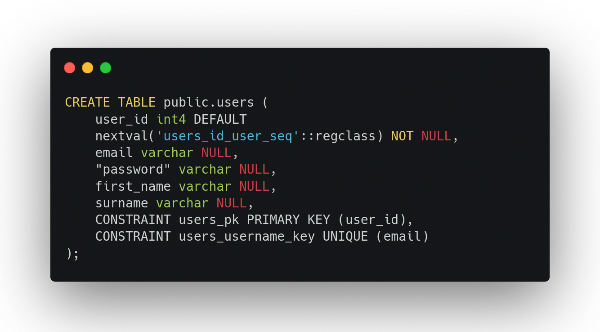

Welcome to Weathertop - a robust and user-friendly weather application built with Node.js, Express, and PostgreSQL.

---

## Features
- **Real-time weather updates:** Get the current weather conditions automatically or manually added for any city.
- **Measurements:** Weather in text, temperature, wind, wind direction and air pressure. Furthermore the min. and max. values of each measurement, as well as the trend calculated with the last two recordings.
- **Graphical overview over all weather stations:** Display all stations on a map and directly access their measurement data.
- **User authentication:** Secure your weather stations safely in your personal account.
- **Responsive design:** Enjoy a seamless experience on both desktop and mobile devices.

---

## Technology Stack
- **Backend:** Node.js and Express for a scalable and efficient server-side application.
- **Database:** PostgreSQL for robust and reliable data storage and management.
- **API Integration:** Integration with external weather API from [open-weather-map](https://openweathermap.org/api) for accurate and up-to-date information.
- **Frontend:** Responsive and interactive user interface with the template engine PUG and Bootstrap5

---

## Database setup
### Overview


### Database tables

| Measurements                                      | Stations                               | Users                                         |
|---------------------------------------------------|----------------------------------------|-----------------------------------------------|
|  |  |  |

---

## Requirements
.env file with the constants:

- PORT
- DB_CON_STRING
- API_KEY

---

## File structure

MVC-Pattern:

```bash
.
├── config.js
├── app.js
├── models/
│   ├── measurement-store.js
│   ├── station-store.js
│   └── user-store.js
├── utils/
│   ├── middleware.js
│   ├── weather-analytics.js
│   └── weather-formatter.js
├── view/
│   ├── layout.pug
│   ├── extends/
│   │   ├── index.pug
│   │   ├── registration.pug
│   │   ├── dashboard.pug
│   │   ├── weatherstations.pug
│   │   └── error.pug
│   └── includes/
│       ├── head.pug
│       ├── header.pug
│       └── weather-station-display.pug
└── public/
├── css/
└── images/
```          


